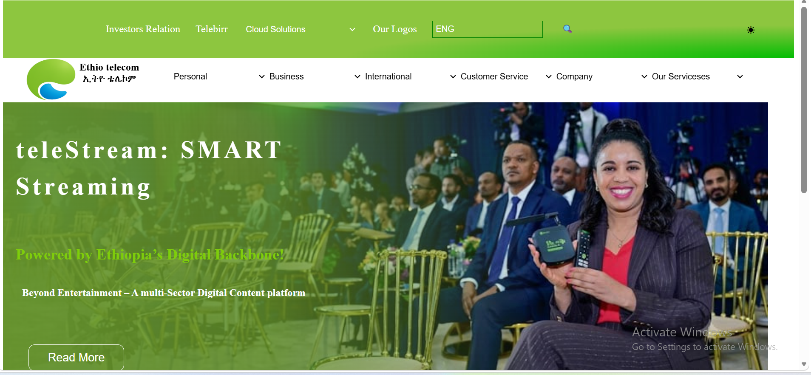

# Ethio Telecom Interface Recreation

## Project Overview

This project is a recreation of the **Ethio Telecom website interface**.

The purpose of this project was to rebuild the structure and visual design of a real Ethiopian web interface using HTML and CSS. The implementation focuses on creating a responsive navigation system, hero banner section, dropdown menus, and a mobile-friendly layout.

---

## Technologies Used

- HTML5
- CSS3
- Flexbox
- CSS Positioning
- Responsive Design (Media Queries)

---

## Layout Implementation

### Flexbox Usage

Flexbox was used to organize and align different components of the interface.

Flexbox was applied in:

- Header layout
- Navigation menu alignment
- Logo and text arrangement
- Dropdown menu lists
- Hero section content alignment

Examples:

```css
header {
    display: flex;
    align-items: center;
    justify-content: space-around;
}
```

```css
nav ul {
    display: flex;
    justify-content: center;
    align-items: center;
    gap: 1.5rem;
}
```

---

## CSS Positioning

### Sticky Element

The sub-navigation bar uses `position: sticky` to remain visible while scrolling.

Example:

```css
.subheader {
    position: sticky;
    top: 0;
}
```

---

### Absolute Positioning

The "Read More" button inside the hero section uses absolute positioning.

The button is positioned relative to the hero section to control its placement.

Example:

```css
.btn {
    position: absolute;
    top: 380px;
    left: 40px;
}
```

---

## Responsive Design

The interface was made responsive using CSS media queries.

Responsive improvements include:

- Navigation adjustment on smaller screens
- Flexible menu arrangement
- Responsive hero section
- Mobile-friendly layout

Example:

```css
@media(max-width:768px){

    nav ul{
        flex-direction:column;
    }

}
```

---

## Main Features

- Ethio Telecom style header
- Navigation menu with dropdown options
- Search input
- Language selector
- Logo section
- Hero banner section
- Responsive mobile layout
- Sticky navigation bar

---

## Project Structure

```
Ethio-Telecom-Interface/
│
├── index.html
├── style.css
├── images/
│   ├── logo.png
│   └── community.png
│
└── README.md
```

---


## Author
   Tehesh Tslalom